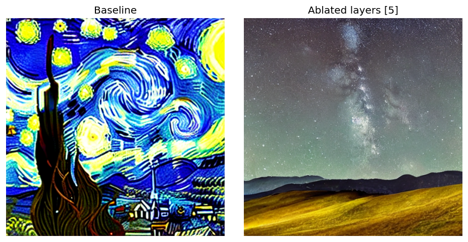
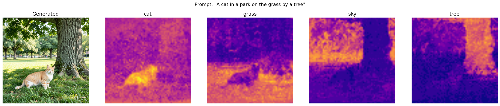
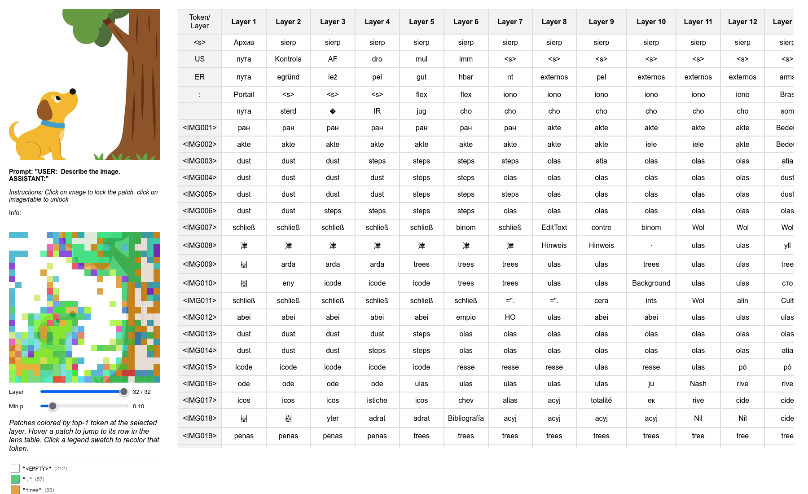

# CVPR 2026 HOW Workshop — companion code

[](https://colab.research.google.com/github/JadenFiotto-Kaufman/CVPR2026-HOW/blob/master/CVPR2026-HOW.ipynb)

Hands-on materials for the *"Vision Interpretability with `nnsight`"* talk at
the **CVPR 2026 HOW Workshop**. The notebook walks through three vision
interpretability methods — re-implemented end-to-end on top of
[`nnsight`](https://nnsight.net) — and this repo holds the same code as
runnable standalone CLIs, one directory per section.

The Colab notebook is the canonical entry point. Each directory here is the
same code, broken out so you can run a single technique without the notebook
scaffolding.

## Repo layout

```
.
├── CVPR2026-HOW.ipynb           ← talk notebook (open in Colab ↑)
├── CVPR2026-HOW.py              ← notebook source (Colab .py format)
├── 1_Attention_Ablation/        ← Section 1
├── 2_Concept_Attention/         ← Section 2
├── 3_VLM_Lens/                  ← Section 3
└── requirements.txt
```

Each numbered directory follows the same convention: a `__main__.py` with the
high-level orchestration (load → trace → save) and a few helper modules with
the implementation details.

## The three demos

### 1. Cross-attention ablation on Stable Diffusion 1.4



Re-implementation of work from
[**JadenFiotto-Kaufman/thesis**](https://github.com/JadenFiotto-Kaufman/thesis)
on top of `nnsight`. SD 1.4's UNet has 16 cross-attention layers — the only
places the text prompt directly steers the image stream. We open a
`model.generate(...)` trace, walk the denoising steps with `tracer.iter[:]`,
and zero the output of whichever cross-attentions we want to ablate.
Side-by-side shows what each one was contributing.

```bash
python 1_Attention_Ablation/__main__.py --prompt "Starry Night" --layers-to-ablate 5
```

### 2. Concept Attention on FLUX.1 / FLUX.2



Re-implementation of [**ConceptAttention** (Helbling et al., CVPR 2025)](https://arxiv.org/abs/2502.04320)
on top of `nnsight`. Concept tokens are appended to the encoder hidden
states; a custom attention mask isolates them two-ways (image ↛ concept,
prompt ↛ concept, concept ↛ prompt) so they ride along on the diffusion
forward pass without changing the image. Per-block attention scores between
the image stream and the concept tokens are accumulated in-trace and
colorised into heatmaps.

```bash
# locally (downloads + runs FLUX.2-klein-4B in-process)
python 2_Concept_Attention/__main__.py \
    --prompt "A cat in a park on the grass by a tree" \
    --concepts cat grass sky tree

# or remotely on NDIF — model weights stay on the server
python 2_Concept_Attention/__main__.py --remote --ndif-host https://api.ndif.us
```

Defaults to FLUX.2-klein-4B (`--model flux2`); pass `--model flux1` for
FLUX.1-schnell.

### 3. VLM logit lens on LLaVA-1.5



Re-implementation of [**Towards Interpreting Visual Information Processing
in Vision-Language Models** (Neo et al., 2024)](https://arxiv.org/abs/2410.07149).
Applies the final norm + lm_head to the residual stream at every intermediate
decoder layer, including the 576 image-token positions, and dumps the result
as a single self-contained interactive HTML — hover any patch to see its
per-layer top-5 next-token predictions, slide between layers to watch the
segmentation refine.

```bash
# locally (loads LLaVA-1.5-7B onto --device, default cuda:0)
python 3_VLM_Lens/__main__.py --image-folder 3_VLM_Lens/images --save-folder ./out

# or remotely on NDIF
python 3_VLM_Lens/__main__.py --image-folder 3_VLM_Lens/images --save-folder ./out \
    --remote --ndif-host https://api.ndif.us
```

## Local vs. remote (NDIF)

Each demo runs the same code two ways:

* **Local** (default) — `dispatch=True` materializes the weights on your GPU.
  Fine for SD 1.4 and the smaller FLUX variants; LLaVA-1.5 fits on one ~16 GB
  card.
* **Remote** (`--remote`) — `dispatch=False` keeps the module tree as meta
  tensors locally and ships the trace to an [NDIF](https://ndif.us)
  deployment. Lets you interactively trace models too large to fit on the
  machine in front of you. Set `--ndif-host` or the `NDIF_HOST` env var to
  pick the endpoint.

## Setup

```bash
pip install -r requirements.txt
```

## Citations

- Fiotto-Kaufman. *Cross-attention ablation experiments on SD 1.4.* [github.com/JadenFiotto-Kaufman/thesis](https://github.com/JadenFiotto-Kaufman/thesis)
- Helbling et al. *ConceptAttention: Diffusion Transformers Learn Highly Interpretable Features.* CVPR 2025. [arXiv:2502.04320](https://arxiv.org/abs/2502.04320)
- Neo et al. *Towards Interpreting Visual Information Processing in Vision-Language Models.* 2024. [arXiv:2410.07149](https://arxiv.org/abs/2410.07149)
- `nnsight` and the NDIF backend: [nnsight.net](https://nnsight.net)
